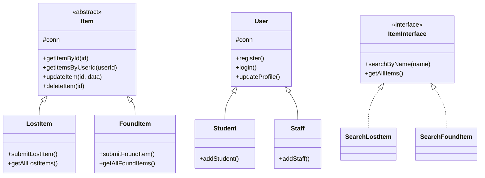

# 🔍 LFMS - Lost & Found Management System (OOP Based)

**LFMS** is a web application designed for university environments to streamline the process of reporting and claiming lost or found items. Unlike traditional procedural systems, this project is built using **Object-Oriented Programming (OOP)** principles to ensure scalability, reusability, and a clean architecture.

Developed in **2025** for the **Object-Oriented Design and Optimization** module.

---

## 🚀 System Workflow

1. **Report Submission:** Students or staff can report lost or found items after registration.
2. **Verification:** Found items must be physically handed to the **Admin Office** with a valid University ID.
3. **Approval:** Admin reviews the item and approves the digital report.
4. **Claiming:** Owners submit a lost report and claim items after identity verification.

---

## 🏗️ Technical Architecture (OOP Highlights)

### 📊 Class Hierarchy (Mermaid Diagram)



---

## 🧠 Core OOP Implementation

### 🔹 Abstraction & Inheritance

* **Item Abstraction:** Abstract class `Item` defines a template for `LostItem` and `FoundItem`.
* **User Hierarchy:** `Student` and `Staff` extend `User` with specific identifiers.

### 🔹 Interfaces

* **ItemInterface:** Defines `searchByName()` and `getAllItems()` methods.
* **PasswordChangerInterface:** Standardizes password update functionality.

### 🔹 Encapsulation & Security

* **PDO:** Secure database interactions using prepared statements.
* **Password Hashing:** Uses `password_hash()` and `password_verify()`.

---

## 📂 Project Structure

```
LFMS/
├── classes/          # Core Logic (OOP Classes & Interfaces)
│   ├── Item.php            (Abstract Class)
│   ├── User.php            (Base Class)
│   ├── LostItem.php        (Inherits from Item)
│   ├── FoundItem.php       (Inherits from Item)
│   ├── ItemInterface.php   (Interface)
│   ├── Staff.php           (Inherits from User)
│   ├── Student.php         (Inherits from User)
│   └── ...                 (Search, Category & Password logic)
├── admin/            # Admin Panel Views & Controllers
├── public/           # User Dashboard, Registration & Login
├── config/           # Database Configuration (PDO Connection)
└── UI/               # Reusable UI Components (Tailwind, Headers, Footers)
```

---

## 🛠️ Tech Stack

* **Backend:** PHP 8.x (OOP)
* **Database:** MySQL (XAMPP / phpMyAdmin)
* **Frontend:** Tailwind CSS
* **Tools:** VS Code, Git, XAMPP

---

## ⚙️ Installation

### 1. Clone Repository

```bash
https://github.com/buddiniweerakkodi/Lost-and-Found-Management-System.git
```

### 2. Database Setup

* Start **Apache** and **MySQL** in XAMPP
* Create database: `lfms`
* Import SQL file from `/database`

> ⚠️ Add admin manually to `admins` table first time.

### 3. Configuration

* Go to `config/Database.php`
* Update:

```php
$host = "localhost";
$db_name = "lfms";
$username = "root";
$password = "";
```

### 4. Run Project

* Move project to `htdocs`
* Open browser:

```
http://localhost/LFMS/public/index.php
```

---

## 🔮 Future Enhancements

* 🖼️ Image Uploads
* 📧 Email Notifications
* 📄 PDF Receipts

---

